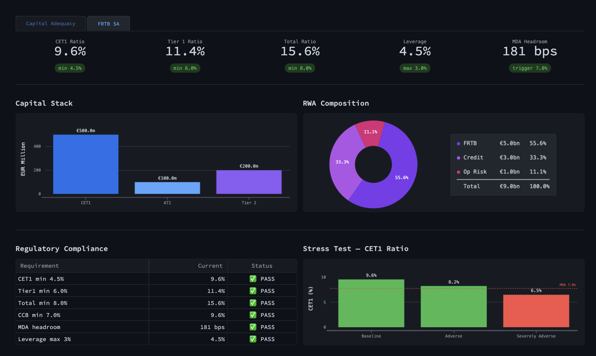

[](https://eur-lex.europa.eu/legal-content/EN/TXT/?uri=CELEX%3A32024R1623)

[](https://eur-lex.europa.eu/legal-content/EN/TXT/?uri=CELEX%3A32024L1619)


# banking-risk


**Banking-risk** translates CRR3, CRD VI, and EBA regulatory requirements into executable Python, covering IRRBB, FRTB SA, CSRBB, ICAAP, liquidity ratios, and credit risk capital. The computation layer is fully separated into [quant-risk-engine](https://github.com/mrspatbile/quant-risk-engine), which handles curve construction, instrument pricing, and sensitivities. This repo is the regulatory layer: bucketing, aggregation, capital computation, and reporting, built against the actual regulatory texts.



---

## Regulatory scope

| Module     | Regulatory reference                    |
| ---------- | --------------------------------------- |
| `irrbb/*`  | EBA/RTS/2022/10                         |
| `csrbb/*`  | EBA/GL/2022/14                          |
| `frtb/*`   | CRR3 Art. 325bb                         |
| `lcr.py`   | CRR + DR 2015/61 + EBA/GL/2019/02 (reporting/outflow rates) |
| `nsfr.py`  | CRR (Arts. 428a et seq.)                |
| `ilaap.py` | EBA/GL/2021/01 + ECB ILAAP Guide |
| `credit_risk/` |  CRR Art. 153 (IRB formula), Art. 163 (PD), Art. 228–230 (LGD)                   | 

## Approach

All modules implement the Standardised Approach. FRTB SA follows CRR3 prescribed vertex grids, risk class bucketing, within-bucket netting, correlation matrices, and capital computation across delta, vega, and curvature. IRRBB covers EVE and NII repricing gaps per EBA/RTS/2022/10, with the six prescribed parallel and non-parallel shock scenarios. LGD applies collateral haircuts per CRR Art. 228-230.

---

## Stack

- Python 3.13
- [quant-risk-engine](https://github.com/mrspatbile/quant-risk-engine) — curve construction, QuantLib pricing
- numpy / scipy / pandas — numerical core
- matplotlib / plotly / seaborn — visualisation
- JupyterLab — interactive analysis

---

## Setup

Clone both repos side by side:

```bash
git clone https://github.com/mrspatbile/quant-risk-engine.git
git clone https://github.com/mrspatbile/banking-risk.git
```

Create a virtual environment and install:

```bash
cd banking-risk
python3 -m venv .venv
source .venv/bin/activate

pip install -e ../quant-risk-engine
pip install -e .[dev]
```

Configure environment variables:

```bash
cp .env.example .env
# add FRED_API_KEY to .env
```

Verify:

```bash
pytest tests/ -v
```

---

## Notebooks

Notebooks illustrate usage of the features implemented in the package.

```
notebooks/
01_irrbb.ipynb  
02_frtb_girr.ipynb                  
03_csrbb.ipynb       
04_credit_risk.ipynb            
05_liquidity_ratios.ipynb     
06_liquidity_monitoring.ipynb
07_frtb_sa.ipynb
08_capital_adequacy.ipynb
```

---

## Project layout

```
📁 src/banking_risk/
│
├── 📁 irrbb/
│   ├── scenarios.py
│   ├── nii.py
│   ├── eve.py
│   ├── gap.py
│   ├── book.py
│   └── constants.py
│
├── 📁 csrbb/
│   └── spread_risk.py
│
├── 📁 frtb/
│   ├── 📁 girr/       
│   ├── 📁 commodity/  
│   ├── 📁 csr/        
│   ├── 📁 fx/         
│   ├── 📁 equity/     
│   ├── sensitivity_engine.py
│   ├── sa.py
│   ├── vertex_mapping.py
│   ├── aggregator.py
│   ├── constants.py
│   └── portfolio.py
│
├── 📁 credit_risk/
│   ├── pd.py
│   ├── lgd.py
│   └── el.py
│
├── 📁  liquidity/
│   ├── collateral.py
│   ├── funding_gap.py
│   ├── intraday.py
│   ├── nsfr.py
│   ├── lcr.py
│   ├── ilaap.py
│   ├── stress.py
│   └── ewi.py
│
├── 📁 shared/
│   ├── curve_projection.py
│   ├── curves.py
│   └── dates.py
│
├── 📁 reporting/
│   ├── dashboard.py
│   └── charts.py
│
📁 tests/
    └── test_*.py  (602 tests)

 ```
---

## Tests

```bash
pytest tests/ -v
```

CI runs on every push and pull request to `main` via GitHub Actions (`.github/workflows/test.yml`). Current suite: 602 tests.


